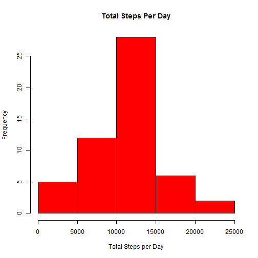
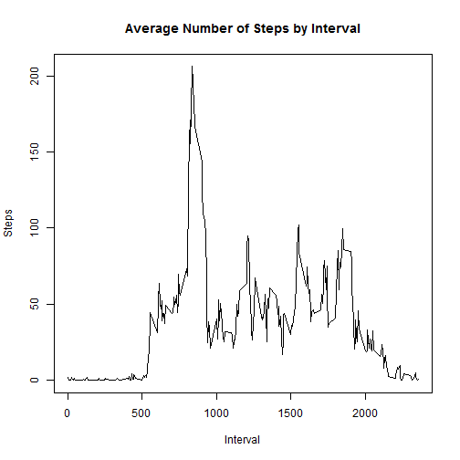
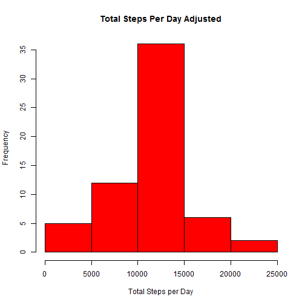
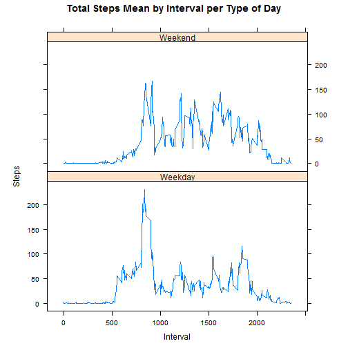

#Reproducible Research: Peer Assessment 1

##Loading and Preprocessing Data

###Accessing the Data

```r
fileUrl <- "https://d396qusza40orc.cloudfront.net/repdata%2Fdata%2Factivity.zip" ##allocate link where data file is stored in the web
download.file(fileUrl,destfile="data.zip")#download the file and save in current directory.
unzip("data.zip") #extract file from zip.
```

###Data Preprocessing

```r
data<-read.csv("activity.csv", header=TRUE)# load data in csv format.
cleandata <-na.omit(data) #omit all na values and create a tidy data table.
```

##What is mean total number of steps taken per day?

###Calculate Total Number of Steps per Day

```r
totalsteps<-aggregate(steps ~ date,data=cleandata,sum)
```

###Histogram of the total number of steps per day

```r
hist(totalsteps$steps, col="red",main="Total Steps Per Day",xlab = "Total Steps per Day")
```



###Calculate the Mean of the Total Number of steps per Day

```r
meantotalsteps<-mean(totalsteps$steps)
print(meantotalsteps)
```

```
## [1] 10766.19
```

###Calculate the Median of the Total Number of steps per Day

```r
mediantotalsteps<-median(totalsteps$steps)
print(mediantotalsteps)
```

```
## [1] 10765
```

##What is the average daily activity pattern?

###Time Series Plot of Daily Activity Pattern of the 5-minute interval and the average number of steps taken across all days

```r
stepinterval<-aggregate(steps~interval, data=cleandata, mean)
plot(stepinterval$interval, stepinterval$steps,type="l", xlab="Interval", ylab="Steps", main="Average Number of Steps by Interval")
```



###Calculating the interval with maximum number of steps

```r
maxstepinterval<-stepinterval[which.max(stepinterval$steps),]$interval
print(maxstepinterval)
```

```
## [1] 835
```

##Imputing missing values

###Number of Missing Values in Dataset

```r
missing<-is.na(data)
print(sum(missing))
```

```
## [1] 2304
```

###Define a function to recover the steps missing from all intervals

```r
meanstepinterval<-function(interval){
  stepinterval[stepinterval$interval == interval,]$steps
  }
```

###Create a new data set with values of the mean steps for each interval where NA was

```r
newdata<-data
for(i in 1:nrow(data)) {
  if(is.na(data[i,]$steps)){ 
    newdata[i,]$steps <- meanstepinterval(newdata[i,]$interval)
  }
}
```

###Plot histogram of the total number of steps taken per day

```r
totalsteps2<-aggregate(steps ~ date,data=newdata,sum)
hist(totalsteps2$steps, col="red",main="Total Steps Per Day Adjusted",xlab = "Total Steps per Day")
```



###Calculate mean of the steps per day in new adjusted data set

```r
meantotalsteps2<-mean(totalsteps2$steps)
print(meantotalsteps2)
```

```
## [1] 10766.19
```

###Calculate median of the steps per day in new adjusted data set

```r
mediantotalsteps2<-median(totalsteps2$steps)
print(mediantotalsteps2)
```

```
## [1] 10766.19
```

Observation: the mean value did not change, as the missing values were substituted by mean values. The median has now varied slightly, and it is similar to the mean, as the mean values were using in the missing data

##Are there differences in activity patterns between weekdays and weekends?

###Create new data file with date coded in weekday or weekend

```r
newdata$day<-ifelse(weekdays(as.Date(newdata$date))=="Saturday","Weekend",ifelse(weekdays(as.Date(newdata$date))=="Sunday","Weekend","Weekday"))
```

###Plot total number of steps taken per day by day type

```r
totalsteps3<-aggregate(steps~interval+day,data=newdata,mean)
library(lattice)
xyplot(totalsteps3$steps~totalsteps3$interval|factor(totalsteps3$day),data=newdata,aspect=1/2,type="l",xlab="Interval",ylab="Steps",main="Total Steps Mean by Interval per Type of Day")
```


